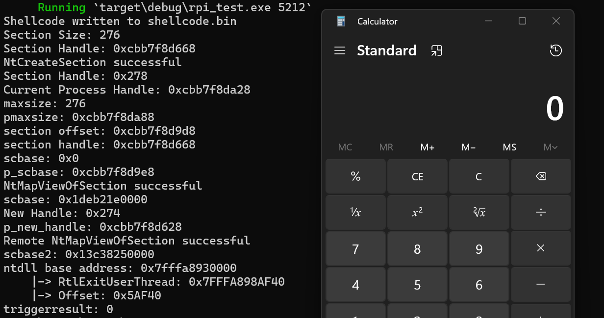

### RPI

RPI is a Rust library that provides low-level process injection capabilities for Windows systems. It offers a set of functions to interact with Windows APIs, particularly focusing on NT APIs, to perform process manipulation and code injection. It was written for use in the [Tempest c2 project](https://github.com/Teach2Breach/Tempest), but can be used independently.

#### Features

- Dynamic resolution of Windows API functions
- Memory allocation and manipulation in remote processes
- Shellcode injection into remote processes
- Utility functions for working with Windows DLLs and functions

#### Installation

Add this to your `Cargo.toml`:

```toml
[dependencies]
rpi = { git = "https://github.com/Teach2Breach/rpi.git" }
```

#### Usage

For an example of how to use this library, please refer to the `main.rs` file in the repository. It demonstrates how to inject shellcode into a target process using the RPI library. If you want to test it out, you can run `cargo run` <target pid> and it will pop calc. 



The example in main.rs also writes the shellcode to a file called shellcode.bin. The reason for this is because the rpi library is expecting shellcode not a file path, so that it can be easily used by implants reading from a buffer in memory. So for the demo, we write the shellcode to a file, then read it into a buffer and use that as the shellcode input.

#### Process Handle Acquisition

The RPI library does not include a function to obtain a process handle. This is intentional, allowing users to implement their preferred method of handle acquisition based on their specific needs and security considerations.

The `main.rs` file in this repository provides an example of how to obtain and duplicate a process handle using the following Windows APIs:

- `NtGetNextProcess`
- `GetProcessId`
- `DuplicateHandle`
- `GetCurrentProcess`

This example demonstrates one possible approach to acquiring a handle to the target process. Users are encouraged to review this implementation and adapt it to their specific requirements or implement their own handle acquisition method.

Remember that the `injection` function in the RPI library expects a valid process handle as one of its parameters. Ensure that you have the necessary permissions and have properly obtained a handle to the target process before calling the injection function.

#### Dynamic Resolution

These APIs are accessed through dynamic resolution to avoid direct imports, using the following functions from the Windows API:

- `LdrGetDllHandle`
- `LdrGetProcedureAddress`

If you want to avoid using those functions, you can use [dinvoke_rs](https://github.com/Kudaes/DInvoke_rs) or check my [noldr repo](https://github.com/Teach2Breach/noldr) for resolving functions from a PEB walk.

#### Process Injection Technique

RPI uses the following steps for process injection:

1. Create a section object using `NtCreateSection`
2. Map the section into the current process with `NtMapViewOfSection`
3. Copy the shellcode into the mapped section 'std::ptr::copy_nonoverlapping'
4. Map the section into the target process with `NtMapViewOfSection`
5. Create a suspended thread in the target process with `NtCreateThreadEx`
6. Queue an APC to the suspended thread with `NtQueueApcThread`
7. Resume the thread with `NtAlertResumeThread`
8. Wait for the thread to complete using `NtWaitForSingleObject`

While copy_nonoverlapping doesn't call Windows APIs directly, it's worth noting that the Windows kernel provides a function called RtlCopyMemory, which is essentially equivalent to memcpy. However, Rust's standard library implementation doesn't use this Windows-specific function.

#### Credits

Much of this code was originally based on UrbanBishop:
https://github.com/FuzzySecurity/Sharp-Suite/blob/master/UrbanBishop/Program.cs
https://github.com/FuzzySecurity/Sharp-Suite/blob/master/UrbanBishop/BerlinDefence.cs


